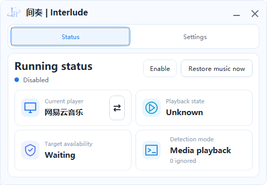

# Interlude

**Language / 语言：** [中文](#中文说明) | [English](#english)

## 中文说明

Interlude 是一个轻量级 Windows 后台工具，用来协调音乐播放器和其他应用的声音。当其他应用开始播放声音时，它可以自动暂停你选择的音乐播放器，并且只恢复由 Interlude 自己暂停过的音乐。

### 功能

- 通过 Windows 媒体会话选择 Interlude 需要监测的音乐播放器。
- 根据声音活动、媒体播放状态或混合模式自动暂停和恢复音乐。
- 可配置声音触发阈值、轮询间隔、开始确认时间、静音确认时间和恢复延迟。
- 支持忽略指定应用，避免这些应用的声音触发自动暂停。
- 支持系统托盘运行、最小化到托盘、关闭到托盘。
- 支持随 Windows 开机启动。
- 支持尊重用户手动播放变更，避免自动控制覆盖用户操作。
- 支持需要时手动恢复音乐。
- 可从主界面或托盘菜单打开日志目录。
- 支持英文和简体中文界面。

### 截图

| 截图 | 说明 |
| --- | --- |
|  | 状态页集中展示当前播放器、播放状态、目标可用性和检测模式，方便快速确认自动控制是否正在工作。 |

### 下载

普通用户不需要下载源码，也不需要自行构建。请从 GitHub Releases 页面下载 Windows 发布版本：

https://github.com/ZephyrWn/Interlude/releases

v0.8.0 请下载 `Interlude-v0.8.0-win-x64.exe`。如果下载的是 ZIP 文件，请先完整解压后再运行 Interlude。

### 使用方法

1. 下载 Release 文件。
2. 如果下载的是 ZIP 文件，请先解压。
3. 运行 `Interlude.exe`。
4. 在首次启动时选择语言和默认音乐播放器。
5. 根据需要配置检测模式、忽略应用、开机启动和托盘行为。
6. 让 Interlude 在后台运行，或最小化到系统托盘。

### 系统要求

- Windows 10 或 Windows 11
- x64 系统

v0.8.0 的 Windows x64 发布版本是自包含版本，普通用户不需要额外安装 .NET Runtime。

### 从源码构建

从源码构建仅适用于希望查看代码、修改功能或参与开发的开发者。普通用户请直接下载 Release 版本使用。

要求：

- .NET SDK 8.0
- 支持桌面应用构建的 Windows 环境

构建：

```powershell
dotnet build Interlude.sln -c Release
```

发布 Windows x64 自包含版本：

```powershell
dotnet publish src/Interlude/Interlude.csproj -c Release -r win-x64 --self-contained true -p:PublishSingleFile=true -p:IncludeNativeLibrariesForSelfExtract=true -p:DebugType=None -p:DebugSymbols=false -o artifacts/publish/win-x64
```

仓库中也包含 `scripts/Build-Release.ps1`，用于发布并验证 Windows x64 单文件可执行程序。

### 许可证

Interlude 使用 MIT License。详情见 `LICENSE`。

### 项目地址

https://github.com/ZephyrWn/Interlude

## English

Interlude is a lightweight Windows background utility that automatically coordinates music playback with other audio activity on your PC. It can pause a selected music player when another app starts producing audio, then resume only the music that Interlude paused itself.

### Features

- Choose the media player Interlude should monitor through Windows media sessions.
- Automatically pause and resume music based on sound activity, media playback, or hybrid detection.
- Configure detection thresholds, polling interval, start confirmation, silence confirmation, and resume delay.
- Ignore selected apps so their audio does not trigger an automatic pause.
- Run from the system tray, minimize to tray, and close to tray.
- Toggle automatic startup with Windows.
- Respect manual playback changes so user control is not overwritten unexpectedly.
- Restore music manually when needed.
- Open the log directory from the app or tray menu.
- Use English or Simplified Chinese UI.

### Screenshots

| Screenshot | Description |
| --- | --- |
|  | The status page shows the current player, playback state, target availability, and detection mode at a glance. |

### Download

Normal users do not need to download or build the source code. Download the Windows release from:

https://github.com/ZephyrWn/Interlude/releases

For v0.8.0, download `Interlude-v0.8.0-win-x64.exe`. If a ZIP file is provided, extract the full ZIP before running Interlude.

### Usage

1. Download the Release file.
2. If you downloaded a ZIP file, extract it first.
3. Run `Interlude.exe`.
4. Choose your language and default music player during setup.
5. Configure the detection mode, ignored apps, startup behavior, and tray behavior as needed.
6. Let Interlude run in the background or minimize it to the system tray.

### System Requirements

- Windows 10 or Windows 11
- x64 system

The v0.8.0 Windows x64 release is published as a self-contained build, so normal users do not need to install the .NET Runtime separately.

### Build From Source

Building from source is intended for developers who want to inspect the code, modify features, or contribute to the project. Normal users should download the Release build instead.

Requirements:

- .NET SDK 8.0
- Windows with desktop application build support

Build:

```powershell
dotnet build Interlude.sln -c Release
```

Publish a self-contained Windows x64 build:

```powershell
dotnet publish src/Interlude/Interlude.csproj -c Release -r win-x64 --self-contained true -p:PublishSingleFile=true -p:IncludeNativeLibrariesForSelfExtract=true -p:DebugType=None -p:DebugSymbols=false -o artifacts/publish/win-x64
```

The repository also includes `scripts/Build-Release.ps1`, which publishes and validates a single-file Windows x64 executable.

### License

Interlude is released under the MIT License. See `LICENSE` for details.

### Project

https://github.com/ZephyrWn/Interlude
